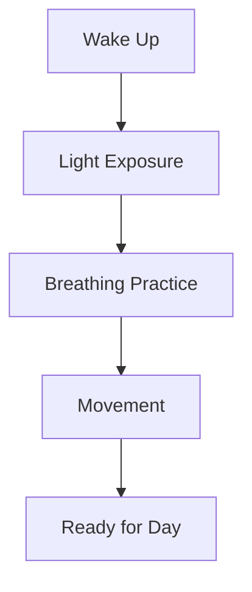

# A Simple Guide to Self-Care: De-stress techniques

## Benefits of De-stress Routine

Regular de-stress practices help prevent burnout, improve sleep quality, and boost mental clarity. Research shows that managing stress strengthens your immune system, enhances decision-making, and promotes better relationships. By incorporating stress management into your daily life, you're investing in both short-term relief and long-term health benefits.

### Impact on Your Health
| System | Benefits | Time to Notice Changes |
|--------|----------|----------------------|
| Physical | • Reduced muscle tension • Better sleep quality • Improved immunity | 2-4 weeks |
| Mental | • Enhanced focus • Better memory • Clearer thinking | 1-3 weeks |
| Emotional | • Stable mood • Better relationships • More resilience | 3-6 weeks |

## Quick Techniques

When stress hits, try these immediate relief methods:
- Bilateral stimulation: Tap your knees alternately for 1-2 minutes while taking deep breaths
- Cold exposure: Hold an ice cube or splash cold water on your face to trigger the calming diving reflex
- Box breathing: Inhale for 4 counts, hold for 4, exhale for 4, hold for 4, repeat
- Progressive muscle release: Tense and release each muscle group, starting from your toes
- Vestibular reset: Gently rotate your head in small circles while seated

## Daily Practices

Build these practices into your routine:
- Morning light exposure: 10 minutes of natural sunlight to regulate cortisol
- Proprioceptive exercises: Wall pushes or palm pressing for grounding
- Humming practice: 5 minutes of sustained humming to activate vagal tone
- Pattern interruption: Trace infinity symbols with your eyes while taking breaks
- Gentle movement: Alternating arm swings while walking

### Morning Routine Map

## Environment

Create a stress-resistant space:
- Set up a designated quiet corner with minimal visual clutter
- Keep a cold pack in your desk drawer for quick relief
- Position your workspace to have a view of nature if possible
- Use textured surfaces (like a pebble mat) for grounding
- Maintain ambient temperature slightly cool (around 68-72°F)

## Resources

Tools and support:
- Free apps: Breathwrk for breathing exercises, Insight Timer for guided practices
- Books: "The Body Keeps the Score" for understanding stress physiology
- Equipment: Basic stress ball, cold packs, textured mat
- Community: Local stress management groups or online forums
- Professional support: When to consider working with a stress management coach

| Category | Free Options | Premium Options |
|--------|----------|----------------------|
| Apps | • Breathwrk • Insight Timer | • Calm • Headspace |
| Equipment | • DIY stress ball • Water bottle | • Weighted blanket • Light therapy lamp |
| Learning | • YouTube guides • Library books | • Online courses • Private coaching |

